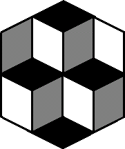

# Cubos - ilusión óptica 
Esta aplicación recrea la conocida ilusión óptica del cubo animándola y haciéndola un poco más interactiva.

## Interacción

* Cambiar el color del fondo.

---
[My github](https://github.com/vacio-informatico/) | [Cubos - ilusión óptica ](https://vacio-informatico.github.io/optical-illusion-cube/)
